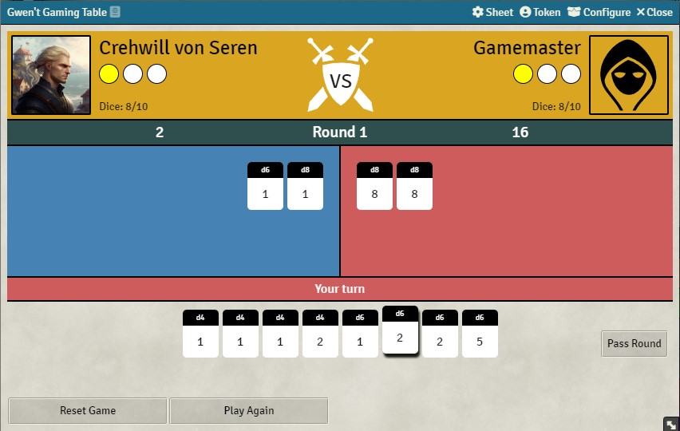
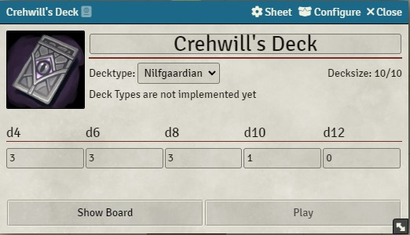
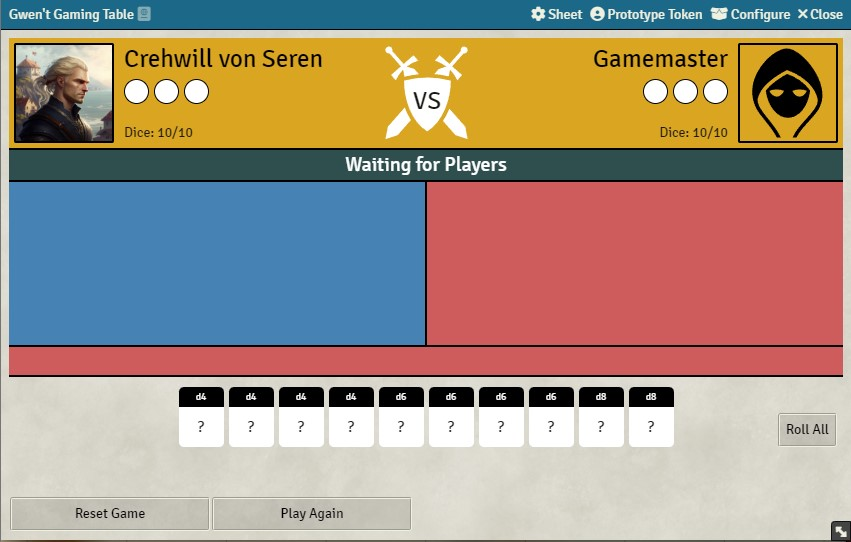
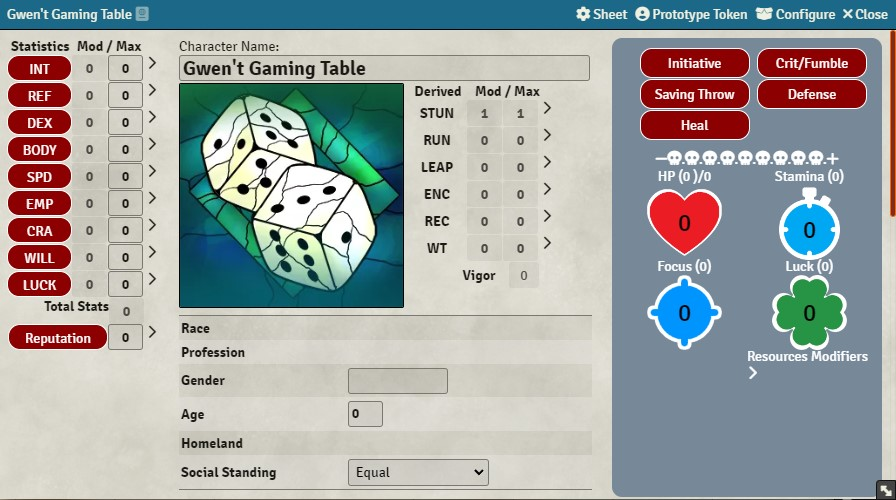
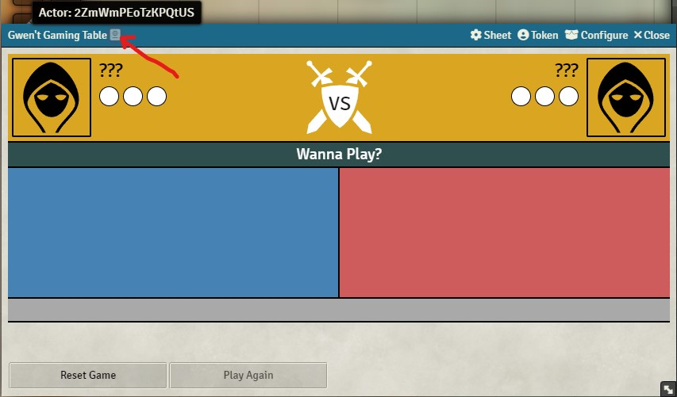
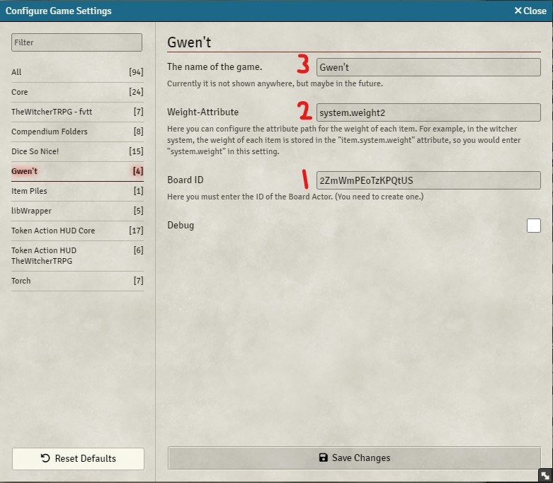
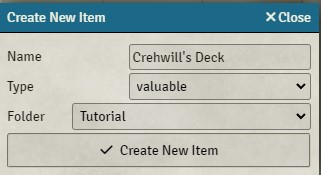
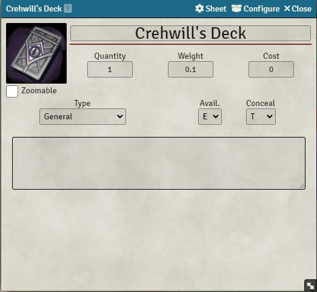

# Gwen't - The Dice Game <!-- omit in toc -->
Gwen't is a simplyfied version of the Witcher card game "Gwent" but with dices, created by u/Dr_Manuka. (Source: https://www.reddit.com/r/WitcherTRPG/comments/ep0cc0/gwent_the_dice_version_of_gwent/)




# IMPORTANT <!-- omit in toc -->
**This document is a complete guide on how to install, configure and play "Gwen't - The Dice Game". So you should read it completely to avoid confusion.**
Even though it's originating from the Witcher franchise, it is **system agnostic**.

- [1. How to Play](#1-how-to-play)
  - [1.1. Rules](#11-rules)
  - [1.2. Start a Game](#12-start-a-game)
    - [1.2.1. Play a Game](#121-play-a-game)
    - [1.2.2. Play again](#122-play-again)
    - [1.2.3. Reset the Game Board](#123-reset-the-game-board)
- [2. Installation](#2-installation)
  - [2.1. Method 1](#21-method-1)
  - [2.2. Method 2](#22-method-2)
- [3. Initial setup](#3-initial-setup)
  - [3.1. Create Game Board](#31-create-game-board)
    - [3.1.1. Create Board Actor](#311-create-board-actor)
    - [3.1.2. Configure Board Settings](#312-configure-board-settings)
    - [3.1.3. Configure Ownership](#313-configure-ownership)
  - [3.2. Creating Decks](#32-creating-decks)
    - [3.2.1. Create Deck Item](#321-create-deck-item)
  - [3.3. Useful Macros](#33-useful-macros)
    - [3.3.1. Start a Game (for Players and GM)](#331-start-a-game-for-players-and-gm)
    - [3.3.2. Open Board (for Players and GM)](#332-open-board-for-players-and-gm)
- [4. Support](#4-support)

<br>

# 1. How to Play
## 1.1. Rules
Please read the [reddit post](https://www.reddit.com/r/WitcherTRPG/comments/ep0cc0/gwent_the_dice_version_of_gwent/) from [Dr_Manuka](https://www.reddit.com/u/Dr_Manuka), since it already explains the rules. But there are some changes or restriction, which I will mention here:

* **In the event of a draw, the player who passed first wins. If a player places his last die, it automatically counts as "pass".** I think this is a fair solution that ensures that all games are finished within 3 rounds.
* If a deck contains more than 10 dice, it will **take the best 10 dice (d12 > d10 > d8 > ...)**. I don't know if some other logic would be nicer/better. Let me know what you think, by creating an issue [here](https://github.com/ortegamarcel/fvtt-gwent/issues).
* **There are no "Easy", "Normal" or "Hard" options available**. Instead I recommend to create some predefined decks with different difficulties and use them the same as players would. A feature is planned, where you can easily configure these predefined decks to easily add them to games. So basically you can then configure as many difficulties as you want.
* **There are no faction bonuses/deck types yet**. You can select it, but it has no effect for now. But that will be added in future. I might adapt these bonuses slightly for balancing purposes.

## 1.2. Start a Game
Here I will explain how two players can play against each other or against the GM. Also, additional features like resetting the board and playing multiple matches in a row.

### 1.2.1. Play a Game
Once, you finished the initial setup, (at least one of) your players should have a deck in their inventory. They should be able to edit it from there (see previous screenshot). When they **click on "Play"**, the deck and player will be added to the board, which will automatically show up to the player. Now another person (or the GM) can do the same (click "Play" on one of their decks).

**The game will automatically start, once two players joined the game board.**



### 1.2.2. Play again
As long as there are two player's joined, **only the GM can click on "Play Again"** to start the game from the beginning.

### 1.2.3. Reset the Game Board
**Only the GM** can see and **click on "Reset Game"**, to remove all joined player's and deck's from the game board, so that other player's can join.

# 2. Installation
## 2.1. Method 1
1. On Foundry VTT's **Configuration and Setup** screen, go to **Add-on Modules**
2. Click **Install Module**
3. Search for **Gwen't - The Dice Game** 
4. Click **Install** next to the module listing

## 2.2. Method 2
1. On Foundry VTT's **Configuration and Setup** screen, go to **Add-on Modules**
2. Click **Install Module**
3. In the Manifest URL field, paste: `https://github.com/ortegamarcel/fvtt-gwent/releases/latest/download/module.json`
4. Click **Install** next to the pasted Manifest URL

# 3. Initial setup
Once installed, you need to make some configurations to make it compatible with the system you are using.

## 3.1. Create Game Board
Before you can play *Gwen't - The Dice Game*, you need to create a game board. Since game boards are not dynamically generated when someone wants to play a game, you need to prepare a game board on which two parties can compete. 

<!-- TODO: Remove once multiple boards are implemented -->
> In the future, it will be possible to prepare multiple game boards so that more players can play simultaneously.

### 3.1.1. Create Board Actor
Create an actor as usual. The type doesn't matter. But I recomment to give it a meaningful name, like "Gwen't Gaming Table".

**IMPORTANT:** If you want to place the actor on the scene, so players can easily open the board by clicking on it, make sure to check "Link Actor Data" on the token properties.



Now click on "Sheet" to open the *Sheet Configuration*-dialog. Select "gwent.BoardSheet" for "This Sheet" and click on "Save Sheet Configuration". Now it should look like this:



Click on the top left icon behind the actor name to copy its ID to the clipboard. This is important for the next step.

### 3.1.2. Configure Board Settings
Go to "Game Settings" -> "Configure Settings" -> "Gwen't". 



1. **Paste the ID of the game board under "Board ID"**

2. **Check if the weight attribute is correct.** It is used to calculate the weight of the deck. If this setting is wrong, the deck will not automatically update it's weight depending on the number of dice it contains, but besides that the module will still work.

3. **(Optional) Change the games name**. If you want you can change the name of the game, so it fits your setting/system. Currently it is not shown anywhere, but that might change in future.

### 3.1.3. Configure Ownership
Now, to make players able to join this game board, you must give all players the "Owner" Permission for this actor.

> For now this is needed, because when a players joins the game board, he will create and add a deck item to that actor. And for that "Owner"-permissions are required.

**HINT:** Tell your players when they join your foundry world for the first time, to select their correct character instead of the Game Board, since it will also appear in the character selection window.

> I will try to find a better solution in future.

## 3.2. Creating Decks
With "deck" I mean a collection of dice, representing a usual deck like used in card games like *Gwent*. At least two are needed to play a match of *Gwen't - The Dice Game*. You can also simply give these decks to your players, through which they can start a game. Since they are regular items, they will also appear in their inventory.

### 3.2.1. Create Deck Item
I am using the Witcher TRPG system, but it will work similar for any system as well.

**First** you **create an item for your players, like you do as usual.** Select a item type so that the deck will be shown in a meaningful place in the players inventory. For me, to show it under *Equipment* -> *General*, I need to select "Valuable". This might be different for your system.



I recommend to give it a meaningful name, i.e. "Crehwill's Deck" and select a nice image.



**Click on "Sheet"** to open the *Sheet Configuration*-Dialog. **Select "gwent.GwentItemSheet" for "This Sheet"**. This is how a item looks in the Witcher TRPG system.


Now you have successfully created a gwent deck, that will behave like all your other items, but can be used to play a game. You can enter which and how many dice will be inside the deck. You need at least 10 dice to be able to play with it.

## 3.3. Useful Macros
### 3.3.1. Start a Game (for Players and GM)
Your **players** can also create a macro to play a game with a specific deck.

1. Click on an empty slot in your quick actions bar at the bottom, so a new macro will be created. (A dialog should show up.)
2. Set type to "script"
3. Enter the following code:

```javascript
(async () => {
  const deckId = "XYZ";
  game.user.character.items.get(deckId).sheet.joinGame();
})()
```
4. Replace "XYZ" with the ID of the/your deck item ID.
    - To get the ID of an item, open the edit dialog and click on the small icon in the top left corner behind the name

**For the GM**, simply remove `.user.character` from the script.

### 3.3.2. Open Board (for Players and GM)
You and your players can create a macro, to easily show the board. Simply create a new macro, set the type to "script" and paste the following code.

```javascript
(async () => {
  const boardId = game.settings.get("fvtt-gwent", "boardId");
  game.actors.get(boardId).sheet.render(true);
})()
```

> Nothing needs to be changed. Works for players and GM.

# 4. Support
For questions, feature requests or bug reports, please open an issue [here](https://github.com/ortegamarcel/fvtt-gwent/issues).

Pull requests are welcome. Please include a reason for the request or create an issue before starting one.
